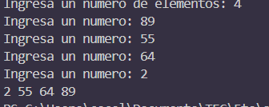
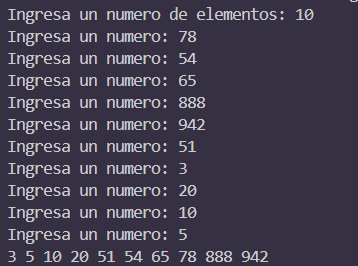
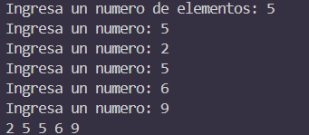
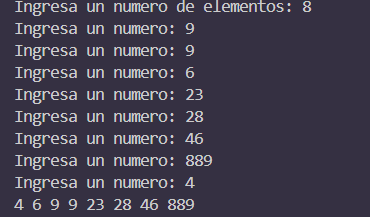

# Merge Sort
This algorithm makes use of the divide and conquer idea, in the way that it separates the elements to be sorted to the minimum and starts sorting them and merging them in pieces.

### Divide
Divide the list into halves.
### Conquer
Each subarray is sorted individually.
### Merge
The sorted subarrays are merged back together.

## Implementation process
We need 2 functions: one to separate and merge, and one to recursively call the previous function.
### Merge function
* We will get an array and its first (left), mid, and last (right) indexes.
* We separate the array in left and right. We get the number of elements to the left by substracting the mid one to the left and adding 1.
> Why do we add 1?
>> This is to ensure we get all of the elements. If we don't add 1, we wouldn't be counting the real amount of elements.
* We create temporary arrays: Left and Right.
* We copy the left elements to Left, and the right elements to Right using a for loop. In the process of filling the Right array, we add 1 along with the loop index variable and the mid element.
> Why do we add 1, again?
>> Since we are already contemplating the mid element inside the Left array, we shouldn't be counting it twice, so we add the 1 to ensure our array starts immediately *after* the left one.
* We reset the i and j loop index variables, and declare a new one, k, that tracks the position of the original array. To ensure the elements are being added to where they're supposed to be (starting with the left), k is equal to the left value.
* We compare the elements from both Left and Right, substituting in the original array and keeping track of the position already managed in all arrays.
* We add the rest of the elements from Left and Right to the original array.
### MergeSort function
The function returns when the left index is no longer smaller than the right. This is to ensure our algorithm's *base case*, meaning this is where it should stop and start going "upwards". When we have that the left and right index is the same, it means we have an array of only one element, and is *inherently sorted*. This if is performed at the beginning so the program returns as soon as possible.
* We obtain the middle of the array by substracting the right with the left and dividing by 2 and adding it to the left to ensure it is in the middle after our left element.
* We call the mergeSort function for the left to the middle and the middle to the right.
* We call the merge function with the now obtained left, middle, and right.
### Main
In the main function, we ask the user for an amount of elements, and we fill a vector until the amount requested. We send the array, the first and last indexes. The sorted vector is printed, an unsigned loop index is used to ensure there's no problems since the size of the array will always be positive.

## Test Cases

